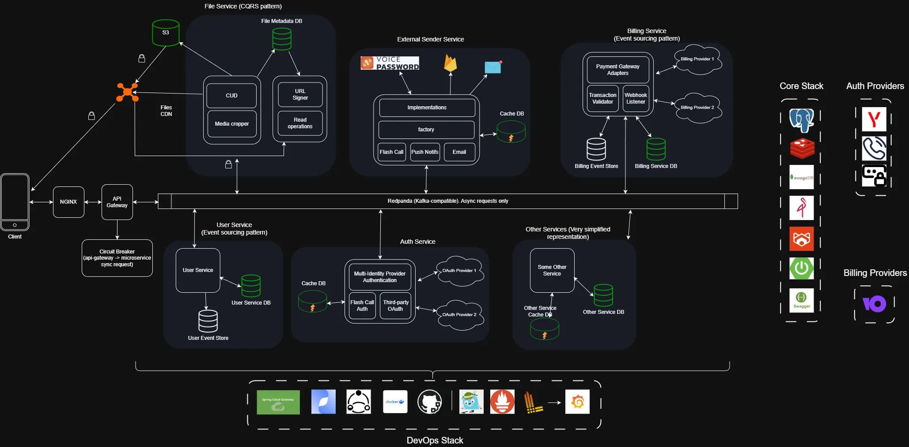
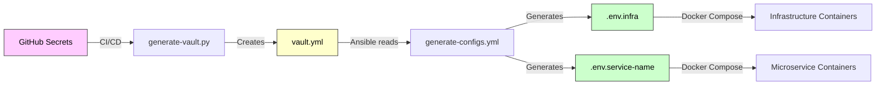
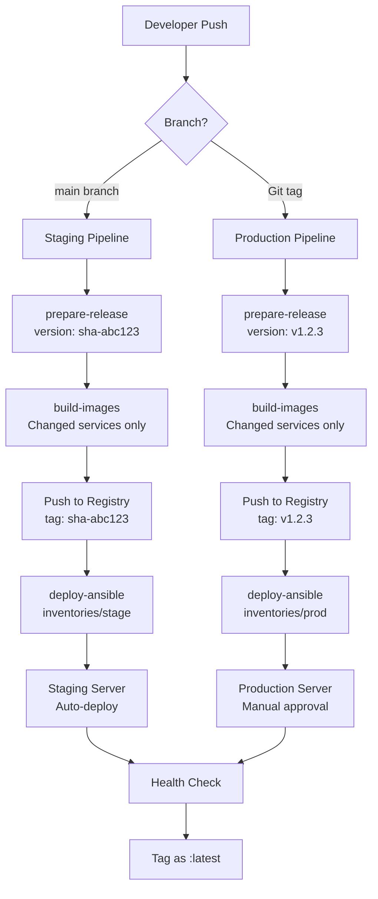

# Architecture Overview

> **⚠️ Documentation Status:** This document describes the **target architecture** for the complete OpenMeal platform. The system is currently under active development. See [README.md](../README.md#implementation-status) for current implementation status of individual microservices.

This document provides a high-level overview of the OpenMeal platform architecture, deployment model, and key technical decisions.

## Business Context

**OpenMeal** is a food ordering and delivery platform that connects:

- **Customers** - Browse restaurants, place orders, track delivery in real-time
- **Restaurants (Partners)** - Manage menus, process orders, update preparation status
- **Couriers** - Receive delivery assignments, navigate to pickup/dropoff locations
- **Support Agents** - Handle incidents, process refunds, manage escalations
- **Administrators** - Verify restaurants, handle escalated cases, analyze operations

### Core Business Flows

1. **Order Lifecycle**: Customer places order → Restaurant prepares → Courier delivers
2. **Courier Assignment**: Automated algorithm selects nearest available courier based on proximity and workload
3. **Real-time Tracking**: Customer sees courier location during delivery
4. **Incident Management**: Support handles issues with escalation to administrators for complex cases
5. **Restaurant Onboarding**: Verification workflow before activation on platform

## System Context



## Deployment Model

### Four-Environment Strategy

The platform uses Docker Compose **profiles** to activate different service sets per environment:

| Environment    | ENVIRONMENT Value | Docker Profile | Services                             | Purpose                            |
| -------------- | ----------------- | -------------- | ------------------------------------ | ---------------------------------- |
| **Local Dev**  | `local-dev`       | `local-dev`    | Postgres, MongoDB, Redis, MinIO      | Developer laptop (minimal CPU/RAM) |
| **Shared Dev** | `shared-dev`      | `shared-dev`   | + Keycloak, Redpanda, Nginx, Certbot | Shared VDS for team                |
| **Staging**    | `stage`           | `stage`        | Full stack (no MinIO, uses cloud S3) | Pre-production testing             |
| **Production** | `prod`            | `prod`         | Full + Prometheus/Grafana            | Production deployment              |

**Key Design Decision:** Keycloak runs only on `shared-dev`/`stage`/`prod` because it's resource-heavy. Local developers connect to shared Keycloak instance.

### Profile Activation Logic

Defined in `makefiles/docker.mk`:

```makefile
# local-dev: minimal infrastructure
COMPOSE_FILES = -f docker-compose.yml -f compose/infra.yml
PROFILES = --profile local-dev

# shared-dev: adds Keycloak, Redpanda, Nginx
COMPOSE_FILES = -f docker-compose.yml -f compose/infra.yml
PROFILES = --profile shared-dev

# stage/prod: full stack + monitoring
COMPOSE_FILES = -f docker-compose.yml -f compose/infra.yml -f compose/monitoring.yml
PROFILES = --profile stage --profile monitoring
```

## Variable Flow: Secrets → Runtime

Understanding how configuration flows from GitHub Secrets to running containers:



### Step-by-Step Flow

1. **GitHub Secrets (per environment)**
   - `INFRA_ENV` - multiline KEY=VALUE for infrastructure passwords
   - `<SERVICE_NAME>_ENV` - per-service environment variables (e.g., `USER_SERVICE_ENV`, `ORDER_SERVICE_ENV`)
   - `SERVICES_ENV` - consolidated service variables (optional, for shared configuration)
   - `YC_REGISTRY_USERNAME`, `YC_REGISTRY_PASSWORD` - Docker registry auth

2. **CI/CD: generate-vault.py**
   - Parses `SECRETS_JSON` from GitHub Actions
   - Creates `vault.yml` with `vault_*` prefixed variables
   - Uses PyYAML for safe escaping (prevents shell injection)

3. **Ansible: generate-configs.yml**
   - Copies `.env.infra.example` → `.env.infra`
   - Replaces placeholders with `vault_*` values via regex
   - Overrides deployment-specific vars (ENVIRONMENT, domains, versions)

4. **Ansible: generate-service-envs.yml**
   - Discovers services from `docker-compose.yml`
   - Extracts `SERVICE_PREFIX_*` from `vault_services_env`
   - Merges with `vault_service_name_env` (per-service takes priority)
   - Creates `.env.service-name` files

5. **Docker Compose Startup**
   - Reads `.env.infra` for infrastructure variables
   - Reads `.env.{service}` for each microservice
   - Activates profiles based on `ENVIRONMENT`
   - Pulls images from Yandex Container Registry
   - Starts containers with healthchecks

6. **Runtime Initialization**
   - **PostgreSQL**: `init-db.sh` creates users from `init-users.conf` (all environments)
   - **MongoDB**: `init-db.sh` creates users/databases (all environments)
   - **Redpanda**: `bootstrap-user.sh` configures SASL/SCRAM auth (shared-dev, stage, prod)
   - **MinIO**: `init-buckets.sh` creates S3 buckets (local-dev only)
   - **Nginx**: `envsubst` generates config from template (shared-dev, stage, prod)

### Environment-Aware Database Configuration

The `prepare-db-configs.sh` script modifies `config/postgres/init-users.conf` based on environment:

- **local-dev**: Comments out Keycloak user (uses shared-dev Keycloak)
- **shared-dev**: Only Keycloak user active
- **stage/prod**: All users active

This prevents resource waste and ensures proper service isolation.

## Microservices Architecture

### API Gateway

- **Responsibility:** Request routing and cross-cutting concerns
- **Functions:** Authentication, rate limiting, request/response transformation, circuit breaking
- **Cache:** Redis (rate limiting, session validation)
- **Pattern:** Single entry point for all client requests

### Microservices Overview

**1. Auth Service**

- **Responsibility:** Authentication and session management
- **Functions:** Login, registration (phone/social), JWT token issuance/refresh/revocation
- **Database:** PostgreSQL (user credentials, sessions)
- **Cache:** Redis (active sessions, refresh tokens)
- **Events Published:** `user.authenticated`, `user.logged_out`

**2. User Service**

- **Responsibility:** User profile management
- **Functions:** Profiles for customers/couriers/partners, addresses, payment methods, verification status
- **Database:** PostgreSQL (user_profiles, addresses, payment_methods)
- **Events Published:** `user.profile.updated`, `user.address.added`
- **Events Consumed:** `user.authenticated` (create profile)

**3. Restaurant Service**

- **Responsibility:** Restaurant and menu management
- **Functions:** Restaurant profiles, menus (dishes, prices, categories), schedules, operational status
- **Database:** PostgreSQL (restaurants, menu_items), MongoDB (reviews, ratings)
- **Storage:** S3 (dish images, restaurant photos)
- **Events Published:** `restaurant.verified`, `menu.updated`, `restaurant.status.changed`

**4. Order Service**

- **Responsibility:** Order lifecycle management
- **Functions:** Cart creation, order placement, status tracking (Created → Confirmed → Preparing → Ready → Picked Up → Delivered)
- **Database:** PostgreSQL (orders, order_items, order_status_history)
- **Events Published:** `order.created`, `order.confirmed`, `order.ready`, `order.picked_up`, `order.delivered`, `order.cancelled`
- **Events Consumed:** `payment.confirmed`, `restaurant.order.accepted`

**5. Payment Service**

- **Responsibility:** Payment processing and refunds
- **Functions:** ЮKassa integration, transaction initiation, refund processing
- **Database:** PostgreSQL (transactions, refunds)
- **External:** ЮKassa payment gateway
- **Events Published:** `payment.confirmed`, `payment.failed`, `refund.processed`
- **Events Consumed:** `order.created`, `support.refund.requested`

**6. Dispatch Service**

- **Responsibility:** Courier assignment algorithm
- **Functions:** Find nearest available courier, calculate ETA, assign delivery task
- **Database:** PostgreSQL (courier_assignments, delivery_tasks)
- **Algorithm:** Proximity-based with workload balancing
- **Events Published:** `courier.assigned`, `delivery.task.created`
- **Events Consumed:** `order.ready`, `courier.available`

**7. Tracking Service**

- **Responsibility:** Real-time courier location tracking
- **Functions:** Collect GPS coordinates, provide location stream to customers
- **Database:** MongoDB (location_history - high write throughput)
- **Cache:** Redis (current courier locations)
- **Events Published:** `courier.location.updated`, `courier.arrived.restaurant`, `courier.arrived.customer`
- **Events Consumed:** `courier.assigned`

**8. File Service**

- **Responsibility:** File storage and metadata management
- **Functions:** Upload/download files, image processing, file metadata tracking
- **Database:** MongoDB (file metadata, upload history)
- **Storage:** S3-compatible storage (MinIO local, S3 production)
- **Events Published:** `file.uploaded`, `file.deleted`
- **Use Cases:** Restaurant photos, dish images, user avatars, receipt documents

**9. External Sender Service**

- **Responsibility:** External notifications
- **Functions:** Push notifications, SMS, email delivery
- **External:** Firebase (Push), SMS gateway, Email service
- **Events Consumed:** All major events (`order.*`, `courier.*`, `payment.*`)
- **Pattern:** Event-driven notification dispatcher

**10. Support Service**

- **Responsibility:** Customer support and incident management
- **Functions:** Ticket creation, refund initiation, temporary account blocking, escalation to admins
- **Database:** PostgreSQL (support_tickets, actions_log)
- **Events Published:** `support.ticket.created`, `support.refund.requested`, `support.escalated`
- **Events Consumed:** `order.*` (for context)

**11. Admin Service**

- **Responsibility:** Platform administration
- **Functions:** Restaurant verification, permanent account actions, escalated incident resolution
- **Database:** PostgreSQL (verification_requests, admin_actions)
- **Events Published:** `admin.restaurant.verified`, `admin.account.blocked`
- **Events Consumed:** `support.escalated`, `restaurant.verification.requested`

**12. Report Service**

- **Responsibility:** Analytics and reporting
- **Functions:** Data aggregation, dashboard generation, operational metrics
- **Database:** MongoDB (aggregated_data, reports)
- **Pattern:** Read-only replica or event sourcing from other services
- **Outputs:** Admin dashboards, partner analytics

### Communication Patterns

**Synchronous (REST API):**

```
Customer → API Gateway → Order Service → Restaurant Service (menu validation)
                      → Payment Service (immediate payment)
```

**Asynchronous (Event-Driven):**

```
Order Service: order.created
    ↓
Payment Service: payment.confirmed
    ↓
Dispatch Service: courier.assigned
    ↓
Tracking Service: courier.location.updated
    ↓
External Sender: notification.sent
```

**Key Events:**

- `order.*` - Order lifecycle (created, confirmed, ready, delivered, cancelled)
- `payment.*` - Payment status (confirmed, failed, refunded)
- `courier.*` - Courier actions (assigned, location.updated, arrived)
- `restaurant.*` - Restaurant changes (verified, menu.updated, status.changed)
- `user.*` - User actions (authenticated, profile.updated)

### Data Storage Strategy

**PostgreSQL:** Orders, Payments, Users, Restaurants (transactional data), Courier Assignments, Support Tickets, Admin Actions

**MongoDB:** Location Tracking (high write throughput), Event Logs, Reviews/Ratings, Audit Logs

**Redis:**

- OTP codes (Auth Service)
- Current courier locations (Tracking Service)
- Restaurant availability cache (Restaurant Service)
- Rate limiting (API Gateway)

**Why This Architecture?**

- **PostgreSQL:** ACID compliance for financial transactions and structured business data
- **MongoDB:** High write throughput for location tracking, flexible schema for weakly structured data (file metadata, reviews), evolving data models
- **Redis:** Sub-millisecond reads for real-time features and caching
- **Per-service databases:** Data isolation and independent scaling

## Build & Deployment Pipeline

### Local Development

```bash
# Initialize configs
make init
# Start services (ENVIRONMENT=local-dev)
make up
# Maven build
make build
# Run tests
make test
```

### CI/CD Pipeline (GitHub Actions)



**Pipeline Differences:**

**Staging (main branch):**

- Automatic deployment on every push
- Version: `sha-{commit_hash}`
- Fast feedback loop for development

**Production (Git tag):**

- Manual trigger via Git tag creation
- Version: `v{major}.{minor}.{patch}`
- Requires explicit release decision

**Shared Features:**

- Incremental builds (only changed services)
- Atomic releases via Ansible
- Health checks before marking success
- Previous images retained for rollback

### Deployment Process (Ansible)

1. **Pre-flight Checks**
   - System resources (RAM ≥1GB, vCPU ≥1, Disk ≥5GB)
   - DNS validation (for SSL environments)
   - Port availability (80, 443)

2. **Infrastructure Setup**
   - Docker installation
   - Security hardening (firewall, unattended-upgrades)
   - SSL certificates (Let's Encrypt)

3. **Application Deployment**
   - File synchronization (rsync)
   - Configuration generation (vault → .env)
   - Image pull from registry
   - Service startup via `docker compose up -d`
   - Old image cleanup

4. **Post-Deployment**
   - Health checks via `check-services.sh`
   - Service status verification
   - Deployment summary

## Security Architecture

### Authentication & Authorization

- **Keycloak**: Centralized identity provider (OAuth2/OIDC)
- **JWT Tokens**: Stateless authentication between services
- **RBAC**: Role-based access control

### Secrets Management

- **Never committed**: `.env.infra`, `vault.yml`, `init-users.conf`
- **GitHub Secrets** → **Ansible Vault** → **Environment Files**
- **File permissions**: `0600` for all sensitive files

### Network Security

- **SSL/TLS**: Let's Encrypt certificates with auto-renewal
- **HSTS**: Strict-Transport-Security headers
- **Firewall**: Only ports 80/443 exposed to internet
- **Docker Networks**: Service isolation via internal networks

### Container Security

- **Distroless Images**: Minimal attack surface (no shell, no package manager)
- **Non-root Users**: All containers run as unprivileged users
- **Health Checks**: Automatic restart on failure
- **SASL/SCRAM**: Redpanda authentication

## Monitoring & Observability

### Metrics (Production Only)

- **Prometheus**: Scrapes `/actuator/metrics` from all services
- **Grafana**: Pre-configured dashboards via provisioning
- **Retention**: 7 days of metrics data

### Health Checks

- **Docker Health Checks**: Built into all service definitions
- **Spring Actuator**: `/actuator/health` endpoints
- **Custom Script**: `scripts/check-services.sh` for manual verification

### Logging

- **Docker Logs**: `docker compose logs -f`
- **Log Levels**: Configurable via environment variables
- **Future**: Centralized logging (ELK/Loki) planned

## Scalability Considerations

### Current State (Monolith-First Approach)

- Single-instance deployment per environment
- Vertical scaling (increase VDS resources)
- Suitable for MVP and early growth

### Future Horizontal Scaling Path

1. **Database**: PostgreSQL replication, MongoDB replica sets
2. **Services**: Multiple instances behind load balancer
3. **State**: Redis for session storage (already in place)
4. **Events**: Redpanda partitioning for parallel processing
5. **Orchestration**: Migration to Kubernetes (see ADR-003)

## Key Design Principles

1. **Environment Parity**: Same codebase runs in all environments
2. **Infrastructure as Code**: Everything automated via Ansible
3. **Immutable Deployments**: Docker images never modified after build
4. **Fail Fast**: Comprehensive pre-flight checks prevent bad deployments
5. **Developer Experience**: Single `make` command for any operation
6. **Cost Optimization**: Incremental deployments, resource-aware profiles

## Related Documentation

- [ADR-001: Monorepo Strategy](adr/001-monorepo.md)
- [ADR-002: Redpanda vs Kafka](adr/002-redpanda.md)
- [ADR-003: Docker Compose for Container Management](adr/003-docker-compose.md)
- [ADR-005: Ansible for Deployment Automation](adr/005-ansible.md)
- [Makefile Reference](MAKEFILE.md)
- [Infrastructure Guide](../infrastructure/README.md)
